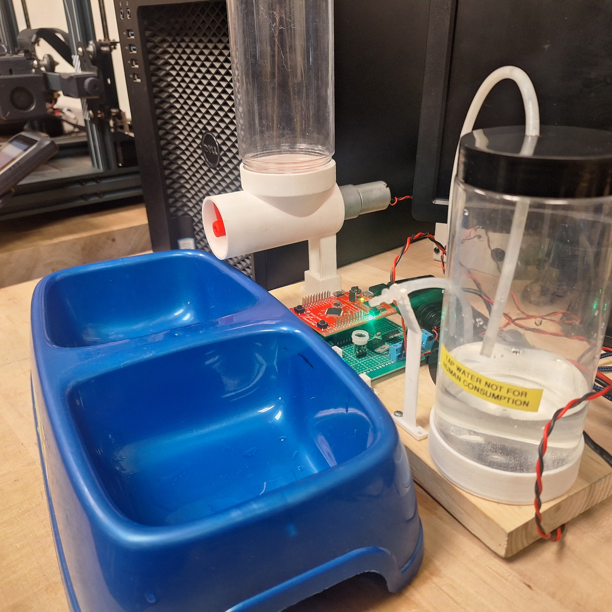

# Pet Feeder
Automatic Pet Food and Water Dispenser

## Overview
This Pet Feeder project combines circuit design, embedded software, sensors and motors all incorporated into a completed usable product.

### Motors and Outputs
It features two motor circuits, a motor-powered auger to dispense pet food, and a pump to dispense water for your pet.
There is also a powered beeper circuit to let the user know when the water level is running low.
The pet feeder runs on an 8v battery, but is designed for permanent use with a wall socket power adapter.

### Sensors and Inputs
The feeder takes in data from a capacitive water level sensor, and a digital FIR motion detector.
There are three copper strips placed underneath the water bowl, wired in a capacitor circuit. This circuit allows for accurate water level measurement without interfering with the pet's fresh water.

