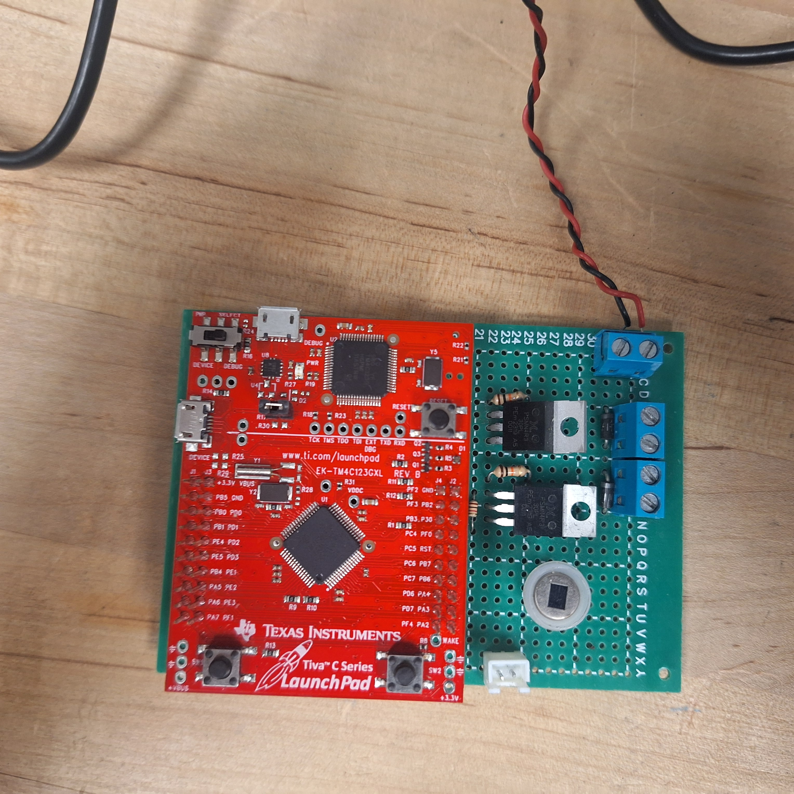

# Pet Feeder
Automatic Pet Food and Water Dispenser

## Overview
This Pet Feeder project combines circuit design, embedded software, sensors and motors all incorporated into a completed usable product.

### Motors and Outputs
It features two motor circuits, a motor-powered **auger** to dispense pet food, and a water **pump** to dispense water for your pet.
There is also a powered beeper circuit to let the user know when the water level is running low.
The pet feeder runs on an 8v battery, but is designed for permanent use with a wall socket power adapter.

### Sensors and Inputs
The feeder takes in data from a capacitive **water level sensor**, and a digital FIR **motion detector**.
There are three copper strips placed underneath the water bowl, wired in a capacitor circuit. This circuit allows for accurate water level measurement without interfering with the pet's fresh water.

### Embedded Software Design
This project was designed for use with the Tiva C TM4C123G Evaluation Board. It is completed as a part of an Embedded Systems course in a Computer Engineering degree. The software utilizes **hardware interrupts** to control the various hardware modules asynchronously for efficient multi-tasking real-world use. The software also takes advantage of several of the on-board peripherals to create custom funcitonalities.

* Real-Time Clock
    - to keep track of time
* EEPROM (Electronically Erasable Programable Read-Only Memory)
    - to store feeding event times
* PWM (Pulse-Width Modulation)
    - To safely control motors
* Analog Comparator
    - To measure water level
* UART Terminal
    - To debug and change settings

### Circuit Design
This project utlizes a soldered circuit board to interface hardware onto the microcontroller's pins. The circuit board has a few different circuits to control various functionality.

* Dual MOSFET motor driver cirucits
    - (8v) to safely power the motors without using the microcontroller's on board power
* BJT controlled speaker circuit
    - to quickly turn on and off the speaker transducer for its resonant frequency to audibly beep on command.
* BJT controlled Capacitance testing circuit
    - as the water level is a function of the capacitance, this circuit uses a pulse and de-integrator to measure the capacitance of the water bowl on command.

 

 
